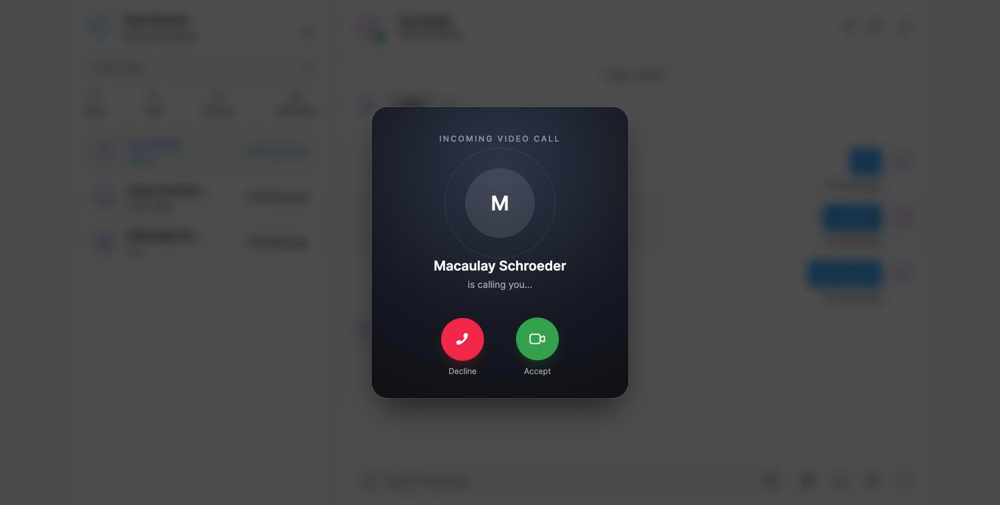
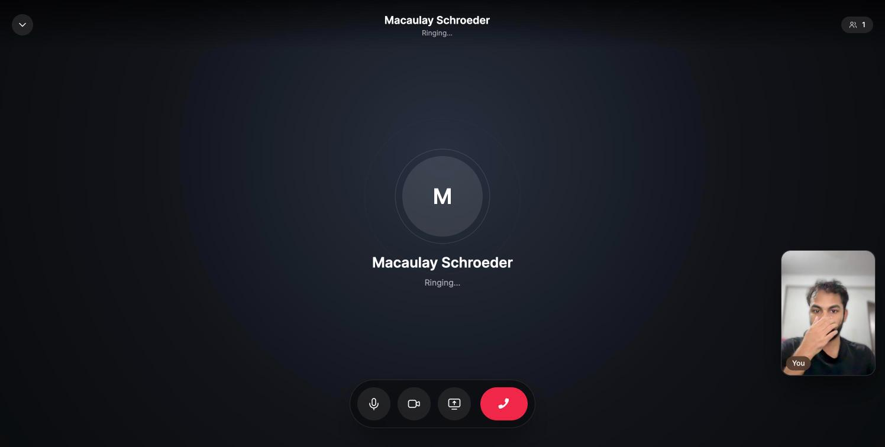
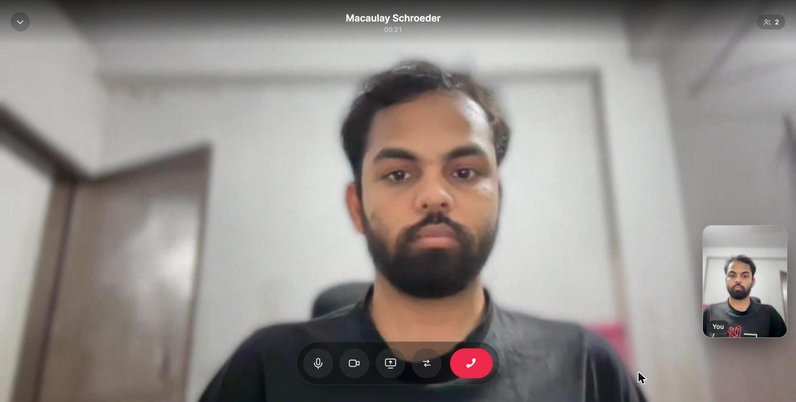

# RTK Chat App

A modern real-time chat application built with React, Redux Toolkit, Express, and Socket.io, organized as a monorepo with Turbo and pnpm.

## 🚀 Features

- **Real-time Messaging** - Instant messaging with Socket.io
- **Video Calling** - Single and multiple user video calls with WebRTC
- **User Authentication** - Secure JWT-based authentication
- **User Management** - User profiles, search, and contact management
- **Chat History** - Persistent message storage and retrieval
- **Modern UI** - Responsive design with Tailwind CSS
- **Monorepo Architecture** - Organized workspace with shared packages

## 📸 Video Calling

Messenger-style call screen built on WebRTC (PeerJS) with Socket.io signalling.

| Incoming call | Ringing |
| --- | --- |
|  |  |



- Full-bleed remote video, with a grid layout once more than one person joins
- Draggable picture-in-picture self view that snaps to the nearest corner; tap it to swap with the main stage
- Control dock (mic, camera, screen share, swap, end call) that auto-hides while the call is connected
- Ringing state with the caller's avatar, live call duration, and participant count
- Incoming call screen with ringtone, and decline that actually stops the caller's ring

## 🏗️ Architecture

This project uses a monorepo structure with the following workspaces:

- **`apps/web`** - React frontend application (Vite + Redux Toolkit)
- **`apps/api`** - Express backend API (Node.js + TypeScript)
- **`packages/ui`** - Shared UI components
- **`packages/eslint-config`** - Shared ESLint configuration
- **`packages/typescript-config`** - Shared TypeScript configuration

## 🛠️ Tech Stack

### Frontend

- **React 19** - UI framework
- **Redux Toolkit** - State management
- **Vite** - Build tool and dev server
- **Tailwind CSS** - Styling
- **Socket.io Client** - Real-time communication
- **PeerJS** - WebRTC video calling

### Backend

- **Express.js** - Web framework
- **TypeScript** - Type safety
- **Socket.io** - Real-time communication
- **MongoDB** - Database
- **JWT** - Authentication
- **Winston** - Logging

### DevOps

- **Turbo** - Monorepo build system
- **pnpm** - Package manager
- **Docker** - Containerization
- **Vercel** - Frontend deployment
- **Render** - Backend deployment

## 📦 Prerequisites

- **Node.js** >= 18
- **pnpm** >= 9.0.0
- **Docker** (for local database)

## 🚀 Quick Start

### 1. Clone the repository

```bash
git clone <repository-url>
cd rtk-chat-app
```

### 2. Install dependencies

```bash
pnpm install
```

### 3. Environment Setup

Copy environment files and configure:

```bash
# For API
cp apps/api/.env.example apps/api/.env

# For Web (if needed)
cp apps/web/.env.example apps/web/.env
```

### 4. Start the development servers

```bash
# Start all applications
pnpm dev

# Or start individually
pnpm --filter @rtk-app/api dev    # Backend only
pnpm --filter @rtk-app/web dev    # Frontend only
```

The applications will be available at:

- **Frontend**: <http://localhost:5173>
- **Backend**: <http://localhost:5000>

## 🐳 Docker Setup (Alternative)

### Backend with Docker Compose

```bash
cd apps/api
docker-compose up -d --build
```

This will start:

- MongoDB database
- Express API server
- Nginx reverse proxy

## 📜 Available Scripts

### Root Level

```bash
pnpm dev          # Start all development servers
pnpm build        # Build all applications
pnpm lint         # Lint all packages
pnpm format       # Format code with Prettier
pnpm check-types  # Type check all TypeScript code
```

### Individual Applications

```bash
# API
pnpm --filter @rtk-app/api dev
pnpm --filter @rtk-app/api build
pnpm --filter @rtk-app/api lint

# Web
pnpm --filter @rtk-app/web dev
pnpm --filter @rtk-app/web build
pnpm --filter @rtk-app/web lint
```

## 🌐 Deployment

### Frontend (Vercel)

- **URL**: <https://rtk-chat-app-cyan.vercel.app>
- **Auto-deploys** from main branch

### Backend (Render)

- **URL**: <https://rtk-chat-app.onrender.com>
- **Auto-deploys** from main branch

## 📁 Project Structure

```md
rtk-chat-app/
├── apps/
│   ├── api/                 # Express backend
│   │   ├── src/
│   │   │   ├── controllers/ # API route handlers
│   │   │   ├── middleware/  # Express middleware
│   │   │   ├── models/      # Database models
│   │   │   ├── services/    # Business logic
│   │   │   └── utils/       # Utility functions
│   │   └── build/           # Compiled TypeScript
│   └── web/                 # React frontend
│       ├── src/
│       │   ├── components/  # React components
│       │   ├── features/    # Redux slices and API
│       │   ├── pages/       # Route components
│       │   └── utils/       # Utility functions
│       └── dist/            # Built assets
├── packages/
│   ├── ui/                  # Shared UI components
│   ├── eslint-config/       # Shared ESLint config
│   └── typescript-config/   # Shared TypeScript config
└── turbo.json              # Turbo configuration
```

## 🤝 Contributing

1. Fork the repository
2. Create a feature branch: `git checkout -b feature/amazing-feature`
3. Commit your changes: `git commit -m 'Add amazing feature'`
4. Push to the branch: `git push origin feature/amazing-feature`
5. Open a Pull Request

## 📝 License

This project is licensed under the ISC License.
