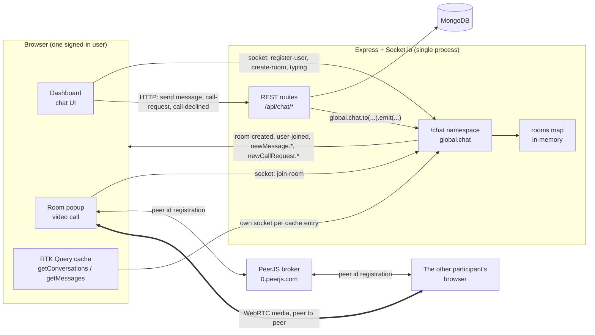
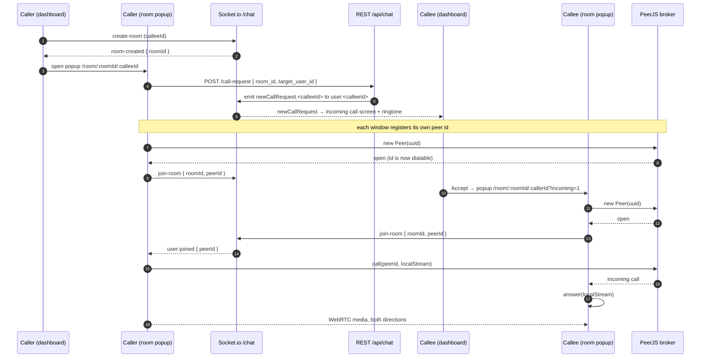
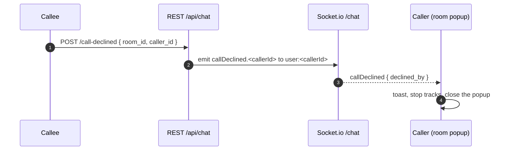
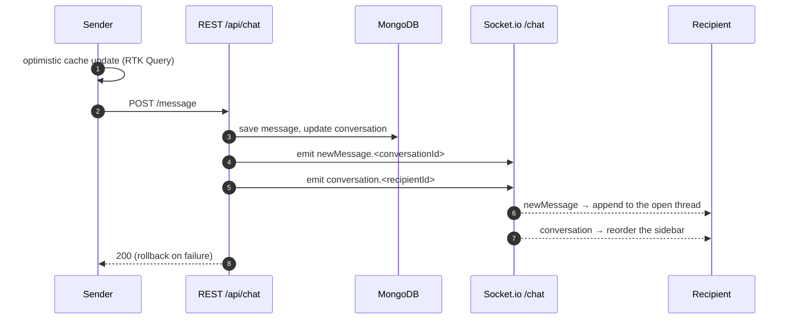

# Socket Server Architecture

How real-time messaging and video calling work in this app: one Socket.io namespace for signalling, WebRTC for the media itself, and HTTP endpoints that push events into the namespace after they write to MongoDB.

## Topology

Socket.io is attached to the same HTTP server as Express (`apps/api/src/index.ts`), so the API and the websocket share one port. Everything real-time lives in the `/chat` namespace, which is stashed on `global.chat` so REST controllers can emit into it.

Media never touches the API server. Socket.io only carries the ids that let two browsers find each other; the audio and video flow directly between peers once PeerJS has connected them.

## Rooms

Socket.io rooms are used for two different purposes:

| Room name | Who is in it | Used for |
| --- | --- | --- |
| `user:<userId>` | Every socket that sent `register-user` with that id | Addressing one user: incoming call, call declined |
| `<roomId>` (a UUID) | Every socket that sent `join-room` for that call | Call participants: peer joined, peer disconnected |

`rooms` in `socket-controller.ts` is a plain object mapping `roomId` to an array of peer ids. It is the source of truth for who is in a call, and it lives in the process memory — see [Limitations](#limitations).

## Event reference

### Client to server

| Event | Payload | Effect |
| --- | --- | --- |
| `register-user` | `userId` | Socket joins `user:<userId>` so call events can be addressed to it |
| `create-room` | `userId` (the person being called) | Generates a `roomId`, creates an empty entry in `rooms`, replies `room-created` to the caller only |
| `join-room` | `{ roomId, userId, peerId }` | Records `peerId` in `rooms[roomId]`, joins the Socket.io room, announces `user-joined` to everyone already there |
| `typing` | `{ conversationId, senderId, senderName }` | Echoed back with `socket.emit` — see [Limitations](#limitations) |

### Server to client

| Event | Sent to | Meaning |
| --- | --- | --- |
| `room-created` | The caller's socket | A room id was minted; open the call window |
| `user-joined` | Others in `<roomId>` | A new `peerId` is dialable in this call |
| `get-users` | The joining socket | Current participant list for the room |
| `user-disconnected` | Others in `<roomId>` | A peer's socket dropped |
| `newCallRequest.<userId>` | `user:<userId>` | Somebody is calling you; show the incoming call screen |
| `callDeclined.<callerId>` | `user:<callerId>` | The person you called declined |
| `newMessage.<conversationId>` | Everyone (broadcast) | A message was written to that conversation |
| `conversation.<userId>` | Everyone (broadcast) | A conversation was created or its last message changed |

The last two are namespace-wide broadcasts; each client filters by the event name it subscribed to.

## Placing a video call

The call is a handshake across three channels: HTTP to ring, Socket.io to exchange peer ids, and WebRTC for the media.

Two ordering rules make this work, and both were bugs before:

- A window announces its peer id over `join-room` **only after** the PeerJS `open` event. Announcing at construction time meant the other side dialled an id the broker had not registered yet and got `peer-unavailable`.
- The answering window opens against the **caller's** id with `?incoming=1`, which suppresses its own `POST /call-request`. Otherwise it rings itself.

If the dial still fails, the caller retries up to four times, one second apart, before giving up.

### Declining

`caller_id` has to come from the client: the server knows who declined (from the JWT) but not who to tell. Without it the endpoint answers `422`.

## Sending a message

Messages are written over REST and fanned out over the socket. The sender updates optimistically, so only the recipients rely on the socket event.

## Client connections

A browser tab holds more than one socket:

| Where | Lifetime | Listens for |
| --- | --- | --- |
| `contexts/RoomContext.jsx` | Module-level singleton, one per tab | `room-created`, plus whatever the mounted page subscribes to (`user-joined`, `user-disconnected`, `newCallRequest.*`, `callDeclined.*`, `typing`) |
| `features/messages/messagesApi.js` | One per RTK Query cache entry, closed when the entry is evicted | `conversation.<userId>`, `newMessage.<conversationId>` |

The call popup is a separate window, so it builds its own singleton socket and its own PeerJS peer. `register-user` is re-sent on every `connect`, so a reconnect re-claims the user room.

## Limitations

Known gaps, all of them things to fix before this runs as more than a demo:

- **`register-user` is unauthenticated.** The socket trusts the id the client sends, so any connected client can join another user's room and receive their call events. The namespace needs a handshake that verifies the JWT and derives the id server-side.
- **`rooms` is in-process memory.** Two API instances behind a load balancer would not see each other's calls, and a restart drops every room. Horizontal scaling needs the Redis adapter plus shared room state.
- **Message events are namespace-wide broadcasts.** `newMessage.*` and `conversation.*` go to every connected client, which then ignores what it did not subscribe to. They should be addressed to `user:<id>` the way the call events now are.
- **`typing` echoes to the sender.** The handler is `socket.emit`, which replies to the socket that sent it rather than `socket.to(room).emit`, so the indicator only ever appears for the person typing.
- **The `disconnect` listener is registered inside `join-room`.** Joining twice on one socket stacks handlers.
- **PeerJS uses the public cloud broker.** No `host`/`port` config, so call setup depends on a third-party service and its rate limits.
